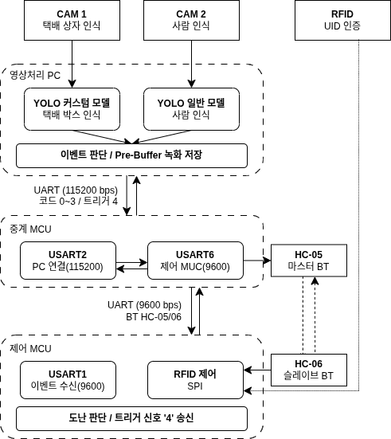

# 택배 수호자 (Parcel Guardian)
 
> YOLO 객체 인식과 STM32 이중 MCU 구조를 결합한 실시간 택배 도난 감지 보안 시스템
 

 
---

## 1. 개요 (Overview)
 
| 항목 | 내용 |
|------|------|
| 플랫폼 | STM32F411RETx × 2, Python (Linux) |
| 언어 | C, Python |
| 도구 | STM32CubeIDE, VSCode, Roboflow |
| 통신 | UART (115200 / 9600 bps), SPI, Bluetooth |
| 개발 기간 | 2025.03 |
| 팀 구성 | 4인 팀 프로젝트 |
 
---
 
## 2. 담당 역할 (My Role)
 
- YOLO 커스텀 모델 학습 — 택배 박스 이미지 1,500장 직접 수집·라벨링 후 모델 학습
- 이벤트 기반 이중 카메라 녹화 시스템 구현 (pre-buffer 포함)
- Python ↔ STM32 양방향 Serial 통신 설계 및 구현 (이벤트 코드 0~3 / 트리거 4)
---
 
## 3. 주요 기능 (Key Features)
 
- **이중 YOLO 인식** — Camera 1 (박스) / Camera 2 (사람) 모델과 카메라를 분리하여 오인식 방지
- **RFID 잠금 인증** — RC522 SPI 직접 제어, non-blocking FSM으로 카드키 UID 인증
- **다중 UART 통신** — PC ↔ 중계 MCU ↔ 제어 MCU, DMA Circular 모드 기반 비동기 직렬 통신
- **이벤트 자동 녹화** — 도난 의심 시 pre-buffer 포함 양방향 카메라 동시 녹화 저장
---
 
## 4. 기술 스택 및 아키텍처 (Tech Stack & Architecture)
 

 

 
---
 
## 5. 핵심 구현 및 트러블슈팅 (Key Implementation & Troubleshooting)
 
### 핵심 구현
 
**① pre-buffer 기반 이벤트 녹화**
이벤트 발생 이전 영상을 메모리 버퍼에 상시 유지하다가 도난 의심 트리거 시 전후 영상을 합산하여 저장한다. 이벤트 전 상황까지 증거로 남길 수 있다.
 
**② DMA Circular 비동기 수신**
중계 MCU에서 UART 수신을 DMA Circular 모드로 처리해 CPU 점유 없이 PC ↔ 제어 MCU 간 데이터를 실시간 중계한다.
 
**③ non-blocking RFID FSM**
SPI 폴링 방식 대신 상태 전이 기반 구조로 RFID 인증과 UART 처리를 병행 동작시켰다.
 
### 트러블슈팅
 
| 발생 문제 | 발생 원인 | 해결 방안 | 결과 |
|-----------|-----------|-----------|------|
| 조명·배경 변화에 따른 인식 불안정 | OpenCV 색상·윤곽선 기반 인식의 환경 의존성 | YOLO 기반 딥러닝 모델로 전환 | 다양한 환경에서 안정적 인식 확보 |
| 카메라 1대 운용 시 박스 오인식 | 대규모 사전학습 모델이 커스텀 모델 출력을 덮어씀 | 카메라 2대로 분리하여 모델 독립 운용 | 인식 충돌 제거 |
| STM 송신값이 Python에서 미수신 | moserial과 Python이 동일 Serial 포트 동시 점유 | 포트를 하나의 프로그램만 점유하도록 수정 | 안정적 양방향 통신 확보 |
 
---
 
## 6. 디렉토리 구조 (Directory Structure)

| 파일 | 역할 |
|------|------|
| `main.py` | YOLO 인식 + 이벤트 판단 + Serial 통신 통합 |
| `relay_mcu/` | USART2 ↔ USART6 브리지, DMA Circular 수신 |
| `control_mcu/` | RFID 인증(SPI1), USART1 이벤트 수신, 도난 판단 |
